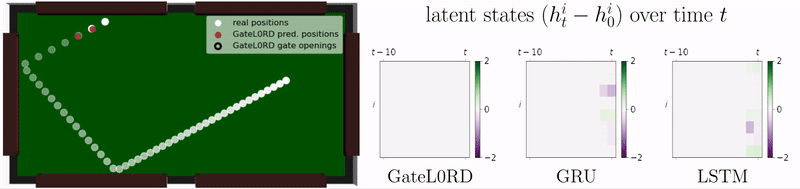

# GateL0RD: Sparsely Changing Latent States for Prediction and Planning in POMDPs

This repository contains a PyTorch implementation of our NeurIPS 2021 paper [Sparsely Changing Latent States for Prediction and Planning in Partially Observable Domains](https://arxiv.org/abs/2110.15949). This includes datasets, environments and experimental settings. 
If you are just looking for a lightweight PyTorch implementation of GateL0RD, please use [this repository](https://github.com/martius-lab/GateL0RD).

## Abstract

A common approach to prediction and planning in partially observable domains is to use recurrent neural networks (RNNs), which ideally develop and maintain a latent memory about hidden, task-relevant factors. We hypothesize that many of these hidden factors in the physical world are constant over time, changing only sparsely. We propose Gated L_0 Regularized Dynamics (GateL0RD), a novel recurrent architecture that incorporates the inductive bias to maintain stable, sparsely changing latent states. The bias is implemented by means of a novel internal gating function and a penalty on the L_0 norm of latent state changes. We demonstrate that GateL0RD can compete with or outperform state-of-the-art RNNs in a variety of partially observable prediction and control tasks. GateL0RD tends to encode the underlying generative factors of the environment, ignores spurious temporal dependencies, and generalizes better, improving sampling efficiency and prediction accuracy as well as behavior in model-based planning and reinforcement learning tasks. Moreover, we show that the developing latent states can be easily interpreted, which is a step towards better explainability in RNNs. 

 

## Installation
We provide an anaconda environment, which can be installed via:

`conda env create -f environment.yml`

Refer to the [iCEM code](https://github.com/martius-lab/iCEM) to run the MPC experiments. 
To run the RL experiments you will need [MiniGrid](https://github.com/maximecb/gym-minigrid) and [this PPO implementation](https://github.com/lcswillems/rl-starter-files). Follow the respective `instructions.txt` file for more details.

## Data and environments 
We provide the (zipped) data for our **Billiard Ball (BB)** experiment and reach-grasp-and-transport data from the **Fetch Pick&Place (FPP)** simulator in `data/`.
After extracting the data, the corresponding experiments can be run out-of-the-box.

Our novel **Robot Remote Control (RRC)** and **Shepherd** problems are implemented as [gym environments](https://gym.openai.com/) in `src/environments/`. 

 &nbsp; &nbsp; &nbsp; &nbsp; &nbsp; 

Run the following code to generate the RRC and Shepherd datasets:

`python3 src/environments/generate_RRC_data_biased.py` (RRC train and testing data)

`python3 src/environments/generate_RRC_data_generalize.py` (RRC generalization data)

`python3 src/environments/generate_Shepherd_data.py` (Shepherd data)

## Running experiments
To run an experiment, execute

`python3 src/main_ENV.py -config settings/ENV/expXYZ.json`

whereas ENV refers to the environment (BB, RRC, Shepherd, FPP_grasping), and XYZ to the experiment in the paper. 
For example run 

`python3 src/main_RRC.py -config settings/RRC/exp2_GateL0RD.json -seed 0`

to run GateL0RD in the RRC generalization experiment. All experiments are provided in `settings/`. With an optional `-seed` argument, different random seeds can be set.
